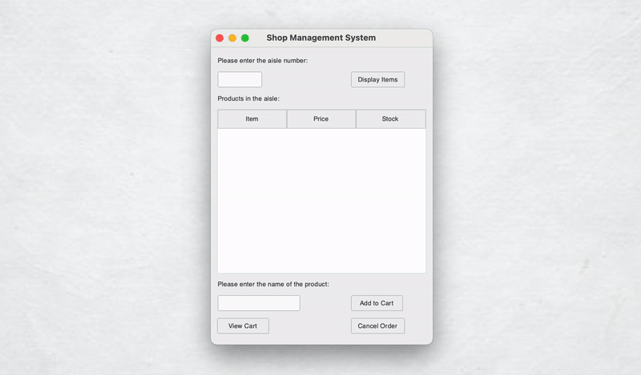

<h1 align="center">Shop Management System</h1>
 

 
 
   

<h2>Project description</h2>
The Shop Management App is a Python-based GUI application designed to manage shop inventory and customer carts. 

Built using <b>Python</b> and <b>tkinter</b> this application allows shop managers to load inventory from a CSV file, display items in specified aisles, 
add products to a customer cart, and proceed to checkout. The app features intuitive error handling and user-friendly messages to ensure smooth operation.
<h2>Features</h2>
<ul>
  <li><b>Load Inventory:</b> Load products from a CSV file.</li>
  <li><b>Display Inventory:</b> Display items from a specified aisle.</li>
  <li><b>Add to Cart:</b> Add selected products to the customer cart.</li>
  <li><b>View Cart:</b> Display items in the cart along with the total cost.</li>
  <li><b>Checkout:</b> Clear the cart and update the inventory file.</li>
  <li><b>Cancel Order:</b> Clear the cart without proceeding to checkout.</li>
</ul>

<h2>Technologies Used</h2>

 Tkinter

<h2>Getting Started</h2>
To get a local copy up and running, follow these simple steps.

<h3>Prerequisites</h3>
Before you begin, ensure you have python and pip installed.

<h3>Installation</h3>
<h5>Clone the repository:</h5>
https://github.com/Yuliia-Kruta/shop-management-system.git

<h5>Navigate to the project directory:</h5>
cd shop-management-system

<h5>Install the dependencies:</h5>
pip install ttkthemes

<h5>Prepare the inventory file:</h5>
Ensure you have an `inventory.csv` file in the same directory as the script. The CSV should have the following columns: Item Name, Price, Aisle, Stock.

<h5>Run the application:</h5>
python main.py

<h2>How to Use</h2>
- <b>Enter Aisle Number:</b> Input the aisle number to view products. 
- <b>Display Items:</b> Click "Display Items" to see products in the specified aisle. 
- <b>Add to Cart:</b> Enter the product name and click "Add to Cart". 
- <b>View Cart:</b> Click "View Cart" to see items in the cart and the total cost. 
- <b>Checkout:</b> Click "Checkout" to complete the purchase and update inventory. 
- <b>Cancel Order:</b> Click "Cancel Order" to clear the cart and reset inventory changes.

<h2>License</h2>
Distributed under the MIT License. See LICENSE for more information.
